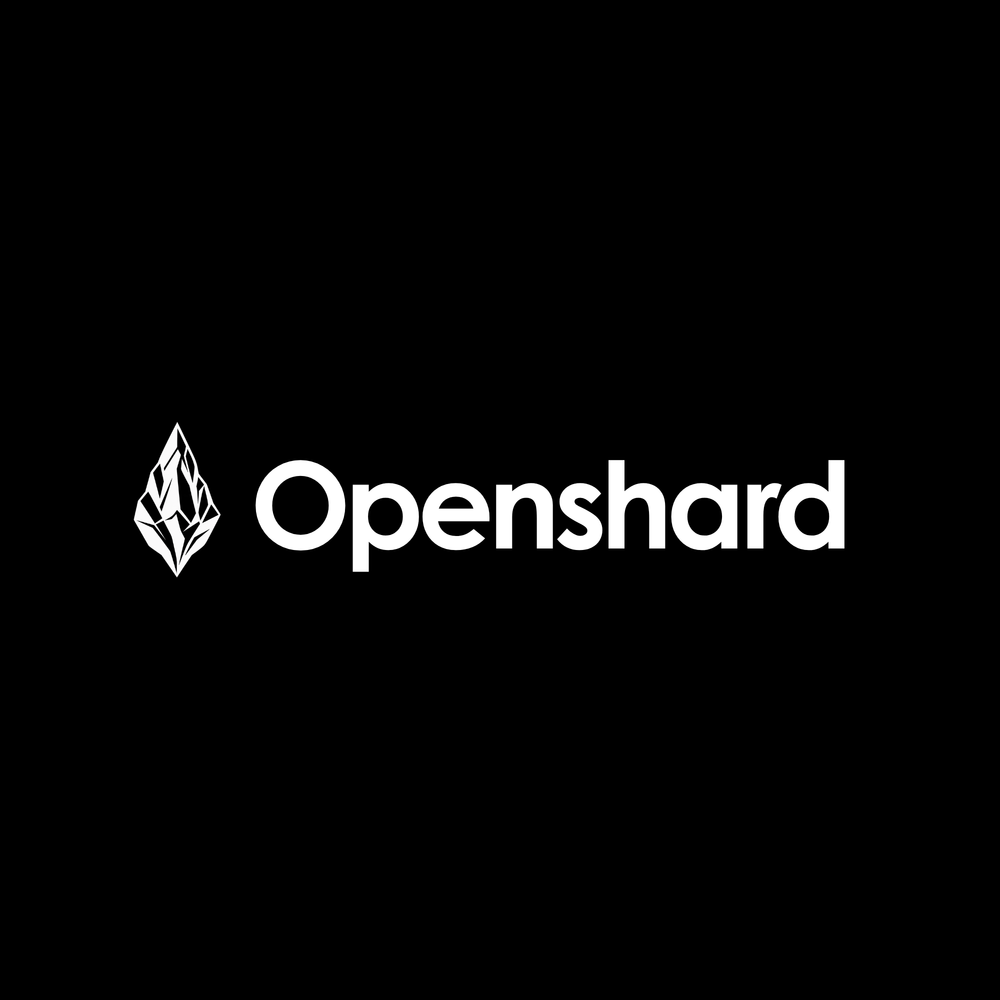

<p align="center">
  <picture>
    <source media="(prefers-color-scheme: dark)" srcset="docs/assets/openshard-wordmark-white.png">
    <source media="(prefers-color-scheme: light)" srcset="docs/assets/openshard-wordmark-black.png">
    
  </picture>
</p>

<p align="center">
  <strong>Receipts for AI coding agents.</strong>
</p>

<p align="center">
  Use Claude Code, Codex, Cursor, or OpenCode normally. Openshard keeps a clear record of what happened: what ran, what changed, what was verified, what it cost, and what it could not establish.
</p>

<p align="center">
  <strong>Agents write code. Openshard keeps the receipt.</strong>
</p>

<p align="center">
  <a href="LICENSE"></a>
  <a href="https://pypi.org/project/openshard/"></a>
  
  <a href="CHANGELOG.md"></a>
</p>

<p align="center">
  <a href="docs/">Docs</a> ·
  <a href="CHANGELOG.md">Changelog</a> ·
  <a href="CONTRIBUTING.md">Contributing</a> ·
  <a href="SECURITY.md">Security</a>
</p>

---

## See Openshard in action

Getting your first receipt takes a couple of commands:

```bash
pip install openshard
cd my-project
openshard setup
```

Now use Claude Code, Codex, Cursor, or OpenCode as you normally would. When the agent finishes:

```bash
openshard last
```

Openshard records the available evidence from the run and turns it into a receipt you can inspect locally.

```text
your coding agent
       ↓
does the work
       ↓
Openshard captures the available evidence
       ↓
receipt
```

You keep your existing coding workflow and Openshard gives that work a record.

<!--
Add the short product demo here once recorded.

Recommended length: 15 to 25 seconds.

Show:
1. openshard setup
2. a normal task in one of the supported coding agents
3. openshard last
4. the resulting receipt

One demo is enough. The supported agents section below shows that the same receipt layer works across all four integrations.
-->

---

## What does a receipt tell you?

A receipt is the saved record of an AI coding run.

Depending on what the agent and its integration expose, Openshard can record the task, coding agent, model, inspected files, file changes, checks, estimated token usage and cost, actions taken during the run, capture completeness, result state, and integrity information.

Each new receipt also has a globally unique `receipt_id`, while the existing `shard_id` remains available for compatibility with local repo history.

The important part is not simply collecting more fields. It is being clear about what Openshard actually knows.

---

## Why receipts?

AI coding agents have long moved past autocomplete and now carry out significant work in real prouction workflows. They inspect repositories, edit files, run commands, execute tests, call tools, and increasingly work on tasks that previously belonged entirely to developers.

Git gives us a durable history of code changes, but it does not always tell us what happened during the AI work around those changes. Which agent handled the task? Which model was used? What did the agent report changing? Which checks actually ran? What failed? What did the run cost? Was any evidence missed? Can we still trust the record we are looking at later?

Openshard exists to preserve that context.
The coding agent still does the coding and Openshard keeps the receipt.

---

## Openshard doesn't guess

Receipts stop being useful if uncertain information is presented as fact.

Openshard is deliberately conservative about what it claims. If the model is unknown, it says `unknown`. If cost was not captured, it says `not recorded`. If part of a session was missed, the receipt records a partial capture.

The same principle applies to code changes. A working tree might already contain human edits, another agent might be active at the same time, or Git might show that a file changed without providing enough evidence to establish who caused it.

Openshard therefore separates files an agent reported changing from changes that were only observed by Git, pre-existing changes, and changes associated with another recorded session. If Openshard cannot establish the actor, it says so.

A finished agent turn is also not automatically treated as proof that the code is correct. An agent can finish successfully while its work remains unverified, so Openshard can report the turn as `Turn completed (unverified)`.

The aim is simple: record the evidence that exists without filling the gaps with guesses.

---

## Receipt identity and integrity

Every new receipt receives a globally unique `receipt_id` when it is created.

Unlike the existing repo-local `shard_id`, the receipt ID is designed to remain unique across repositories, machines, developers, and organisations.

Receipts can also carry a content fingerprint. Openshard can use that fingerprint to check whether the stored record still matches the content from which it was produced.

This is an integrity check on the receipt itself. It is not a claim that the underlying code is correct.

---

## Supported coding agents

Openshard currently captures receipts from:

| Coding agent | Receipt capture |
| --- | --- |
| Claude Code | Supported |
| Codex | Supported |
| Cursor | Supported |
| OpenCode | Supported |

All four can contribute to the same local Openshard history in a repo. You can move between supported agents without creating separate receipt stores or changing the way you normally use those tools.

Run:

```bash
openshard doctor
```

to see which integrations are configured and what Openshard can currently capture.

---

## Getting around your receipt history

The basic workflow is intentionally small.

See the most recent receipt:

```bash
openshard last
```

See more detail:

```bash
openshard last --more
openshard last --full
```

Browse recent AI coding work in the repo:

```bash
openshard history
```

See repo-level statistics:

```bash
openshard stats
```

Check the installation and agent integrations:

```bash
openshard doctor
```

The main receipt commands also support JSON, which makes them useful in scripts and other tooling:

```bash
openshard last --json
openshard history --json
openshard stats --json
```

---

## How capture works

`openshard setup` detects whatever supported coding agents are available for the repo and configures their supported integration points.

The implementation differs slightly between agents. Openshard can use hooks, plugins, local configuration, and MCP-based integration depending on what each tool exposes. Those events are normalised into the same receipt history and passed through a local authenticated capture service.

That means Claude Code, Codex, Cursor, and OpenCode can all leave receipts in the same repo history even though the agents themselves work differently.

For the deeper implementation details, see [Agent capture](docs/agent-capture.md).

---

## Local-first

The open-source receipt layer is local-first. Your receipt history stays with the repo and can be inspected offline.

You do not need a hosted Openshard account to create or inspect local receipts.

Raw developer content is not sent to Openshard by default. Basic privacy-safe product telemetry may be collected after setup, such as versions, counts, timings, and error categories. It does not include code, prompts, file names, or receipt contents.

Telemetry can be disabled at any time:

```bash
openshard telemetry off
```

See [Telemetry](docs/telemetry.md) for the full behaviour.

---

## Installation

The standard installation is:

```bash
pip install openshard
```

Then move into a Git repo and run:

```bash
cd your-project
openshard setup
```

`pipx` and `uv` are also supported:

```bash
pipx install openshard
```

```bash
uv tool install openshard
```

To upgrade later:

```bash
pip install -U openshard
```

or:

```bash
pipx upgrade openshard
```

See [Installation](docs/install.md) for additional installation guidance.

---

## Project status

Openshard is currently a working tool available for use, and the core local receipt loop is working across Claude Code, Codex, Cursor, and OpenCode.

The project has automated CI, Ruff and mypy checks, a large pytest suite, Linux and Windows validation, authenticated local capture, receipt integrity checks, explicit capture-completeness handling, and real integration testing across supported agent paths.

The hosted product is still being built. Shared team receipt history, hosted analytics, and team controls will build on the same receipt primitive rather than replacing the local workflow.

For now, the focus is straightforward: making the receipt layer reliable, useful, and easy enough to fit naturally into the way developers already work.

---

## Why open source?

We believe that evidence infrastructure should be inspectable.

If Openshard says a coding agent changed a file, a check passed, a session was incomplete, or an actor could not be established, developers should be able to understand how that conclusion was reached.

Keeping the local receipt layer open source makes the capture model, integrations, and integrity behaviour available for inspection and improvement.

Openshard is licensed under Apache-2.0.

---

## Documentation

- [Installation](docs/install.md)
- [Agent capture](docs/agent-capture.md)
- [What is a Shard?](docs/what-is-a-shard.md)
- [CLI reference](docs/cli-reference.md)
- [Telemetry](docs/telemetry.md)
- [Changelog](CHANGELOG.md)
- [Security](SECURITY.md)
- [Contributing](CONTRIBUTING.md)

---

## Contributing

Contributions are welcome across receipt capture, coding-agent integrations, provenance, verification, CLI experience, platform compatibility, security, tests, documentation, and examples.

See [CONTRIBUTING.md](CONTRIBUTING.md) to get started.

---

## Security

If you find a security issue, please report it privately before opening a public issue.

See [SECURITY.md](SECURITY.md).

---

## License

Apache-2.0
